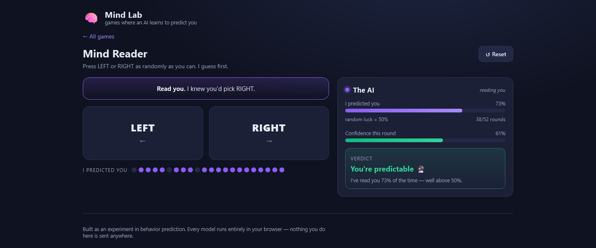
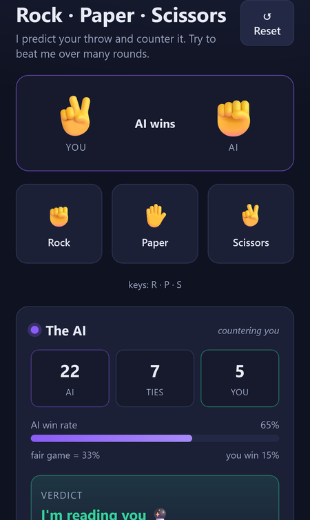
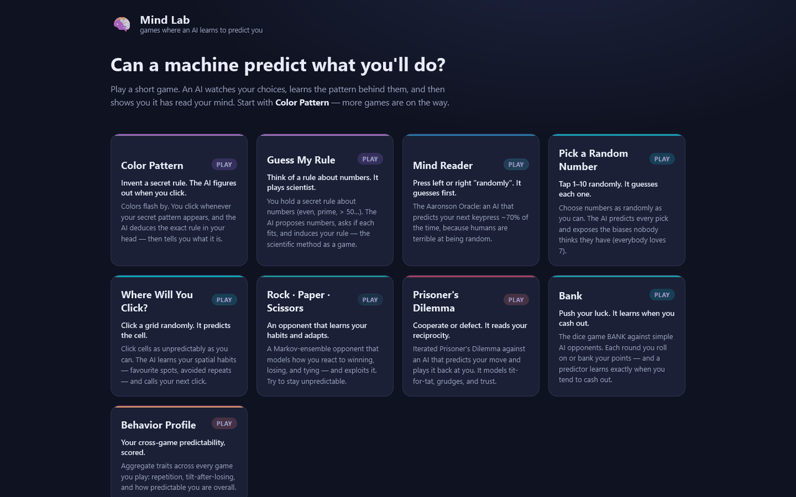

# Mind Lab

Nine small games where an AI watches your choices, learns your habits, and then
proves it can predict what you'll do next. Try to be random; it's harder than it
sounds.

**[▶ Open the live app](https://timothyhadfield.github.io/mind-lab/)** · works on phone and laptop

<p align="center">
  
  &nbsp;
  
</p>
<p align="center">
  
</p>

## Features
- **Nine games** — Color Pattern, Guess My Rule, Mind Reader, Pick a Random Number, Where Will You Click?, Rock · Paper · Scissors, Prisoner's Dilemma, Bank, and a Behavior Profile.
- **It reads your secret rule** — in Color Pattern you invent a rule about when to click, and a Bayesian engine works out the exact rule in your head and tells you.
- **It plays scientist** — in Guess My Rule it picks the most informative numbers to ask about until it knows your number rule.
- **Honest scoring** — every game shows the AI's measured accuracy next to what pure chance would get.
- **Learns in real time** — a team of simple pattern-spotters (frequency, recent history, win-stay/lose-shift, tit-for-tat) is weighted by how well each one is predicting you right now.
- **Behavior Profile** — sums up how predictable you are across all the games you've played.
- **Private** — everything runs in your browser; nothing you do is sent anywhere.

## Built with
React + Vite, plain JavaScript models with Vitest unit tests, hosted on GitHub Pages.

---

## For developers

A small website of games where an AI watches your choices during a short
"training" period, learns the pattern behind them, and then shows you it has
figured you out. Everything runs **entirely in the browser** — no backend, no
data leaves your machine.

The first game is **Color Pattern**: you invent a secret rule about when to
click (based on the recent colors shown), and a Bayesian rule-inference engine
deduces the exact rule in your head — including wildcards and "either/or"
disjunctions — then announces it.

## Run it

```bash
npm install
npm run dev      # http://localhost:5173
```

Other scripts:

```bash
npm test         # unit tests for the inference engine (Vitest)
npm run build    # production build to dist/
npm run preview  # serve the production build
```

> Node is required. If `npm` isn't found on Windows, Node lives at
> `C:\Program Files\nodejs` — add it to PATH or call `npm.cmd` from there.

## How it works

See [`PLAN.md`](./PLAN.md) for the design and research background, and
[`PROGRESS.md`](./PROGRESS.md) for current status and next steps.

The core AI is in
[`src/games/colorPattern/ruleEngine.js`](./src/games/colorPattern/ruleEngine.js):
a Bayesian posterior over every possible rule, with an Occam simplicity prior
and a misclick-noise model. It yields both a live prediction ("should you click
now?") and a confidence that drives the reveal.
